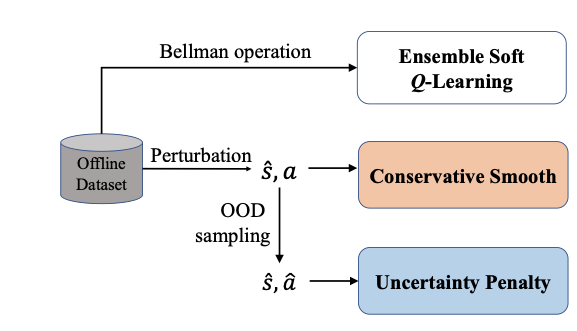

# RORL: Robust Offline Reinforcement Learning via Conservative Smoothing

Code for NeurIPS 2022 paper "Robust offline Reinforcement Learning via Conservative Smoothing". RORL trades off robustness and conservatism for offline RL via conservative smoothing and OOD underestimation.

The implementation is based on [EDAC](https://github.com/snu-mllab/EDAC) and [rlkit](https://github.com/rail-berkeley/rlkit).

<div style="text-align: center;">

</div>


## 1. Requirements

To install the required dependencies:

1. Install the MuJoCo 2.0 engine, which can be downloaded from [here](https://mujoco.org/download).

2. Install Python packages in the requirement file, [d4rl](https://github.com/rail-berkeley/d4rl) and `dm_control`. The commands are as follows:
  
```bash
conda create -n rorl python=3.7
conda activate rorl
pip install --no-cache-dir -r requirements.txt

git clone https://github.com/rail-berkeley/d4rl.git
cd d4rl
# Note: remove lines including 'dm_control' in setup.py of d4rl
pip install -e .
```

## 2. Usage

### 2.1 Training 
#### RORL Experiments for MuJoCo Gym:

```bash
python -m scripts.sac --env_name [ENVIRONMENT] --num_qs 10 --norm_input --load_config_type 'benchmark' --exp_prefix RORL
```
**To reproduce results of adersarial experiments, you can simply replace 'benchmark' with 'attack'.**

#### SAC-10:

```bash
python -m scripts.sac --env_name [ENVIRONMENT] --num_qs 10 --norm_input --exp_prefix SAC
```

#### EDAC:

```bash
python -m scripts.sac --env_name [ENVIRONMENT] --num_qs 10 --eta 1 --norm_input --exp_prefix EDAC
```

### 2.2 Evaluation
#### To evaluate trained agents in clean environments, run
```bash
python -m scripts.sac --env_name [ENVIRONMENT] --num_qs 10 --norm_input --eval_no_training --load_path [model path] --exp_prefix eval_RORL
```
'model path':  e.g., ~/offline_itr_3000.pt.

#### To evaluate trained agents in adversarial environments, run
```bash
python -m scripts.sac --env_name [ENVIRONMENT] --num_qs 10 --norm_input --eval_no_training --load_path [model path] --eval_attack  --eval_attack_mode [mode]    --eval_attack_eps [epsilon]  --exp_prefix eval_RORL
```
'mode': 'random, action_diff, min_Q, action_diff_mixed_order, min_Q_mixed_order'.

'epsilon': [0.0, 0.3]

#### To evaluate trained agents in adversarial environments with different Q functions, run
```bash
python -m scripts.sac --env_name [ENVIRONMENT] --num_qs 10 --norm_input --eval_no_training --load_path [model path] --eval_attack  --eval_attack_mode [mode]    --eval_attack_eps [epsilon] --load_Qs [Qs path] --exp_prefix eval_RORL
```
'Qs path': the path of attacker's Q functions, which can be different from the evaluated agent's Q functions


## Citation
If you find RORL helpful for your work, please cite:
```
@inproceedings{yang2022rorl,
  title={RORL: Robust Offline Reinforcement Learning via Conservative Smoothing},
  author={Yang, Rui and Bai, Chenjia and Ma, Xiaoteng and Wang, Zhaoran and Zhang, Chongjie and Han, Lei},
  booktitle={Advances in Neural Information Processing Systems},
  year={2022}
}
```

## Update
2022.11.26 fixed q smooth loss
